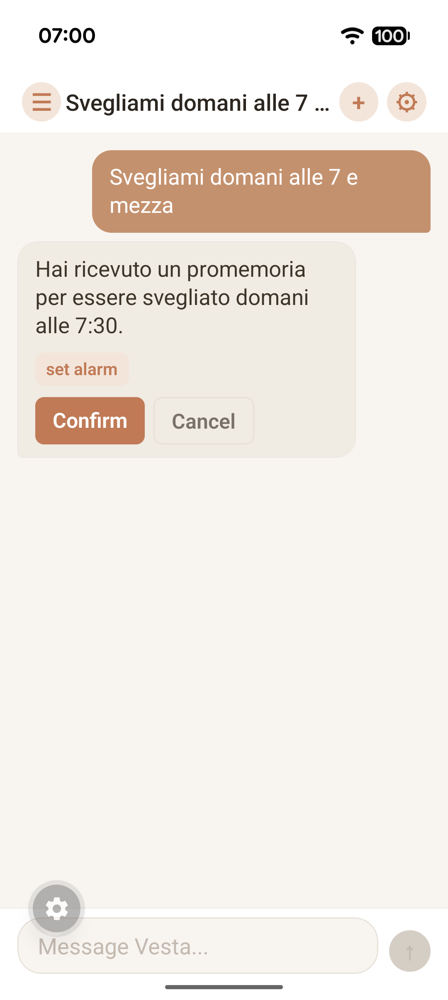
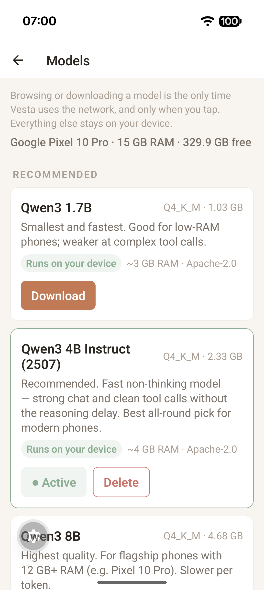

<p align="center">
  
</p>

<h1 align="center">Vesta</h1>

<p align="center">
  <strong>Intelligence that never leaves home.</strong>
</p>

<p align="center">
  An offline-first AI assistant that runs entirely on your phone.<br />
  Chat, set alarms, create events, manage reminders — no internet, no accounts, no data leaving the device.
</p>

<p align="center">
  <a href="LICENSE"></a>
  <a href="#"></a>
  <a href="#"></a>
  <a href="#"></a>
  <a href="#"></a>
  <a href="#status"></a>
</p>

---

## What is Vesta?

Vesta is an AI assistant that lives on your phone, not in the cloud. It runs open language models locally with [llama.cpp](https://github.com/ggerganov/llama.cpp) (via [llama.rn](https://github.com/mybigday/llama.rn)) and turns natural language into real device actions — setting alarms, creating calendar events, scheduling reminders — **without sending a single byte to the internet.**

It's a real chat assistant too: ask questions, brainstorm, draft text, get a recipe. Automation is the bonus, not the whole point.

Named after the Roman goddess of the hearth, Vesta is the sacred fire that never goes out.

- **Offline-first.** Chat, actions, memory, and storage all work in airplane mode. No API keys, no subscriptions, no telemetry. (Voice input is the one optional extra that delegates to the system speech recognizer.)
- **Private by design.** Conversations, memories, and documents stay on your device. Period.
- **Real actions, not just chat.** Natural language maps to native Android intents — `"svegliami alle 7"` actually sets a 07:00 alarm.
- **Bring your own model.** Any GGUF model runs. Download a curated pick in-app, or import your own `.gguf`.
- **Bilingual from day one.** English and Italian, with more languages on the roadmap.

---

## Screenshots

<p align="center">
  
  
  
  
</p>

<p align="center">
  <sub>Real chat · natural-language actions with a confirm step · in-app model manager · conversation history — captured on a Pixel 10 Pro, fully offline.</sub>
</p>

---

## Features

| | |
|---|---|
| 🧠 **On-device LLM** | Runs any GGUF model locally via `llama.rn`. No cloud, no API calls, no vendor lock-in. |
| 📥 **In-app model manager** | Browse a curated, RAM-aware catalog, download with progress/resume, add any HuggingFace GGUF repo, or import a local `.gguf`. Switch or delete anytime. |
| ⏰ **System actions** | All 10 core tools via native Android intents — alarms, calendar events & read, reminders, timers, navigation, calls, SMS, and contacts search — with a confirmation step before any destructive action. |
| 💬 **Real conversation** | A genuine chat assistant, not just a command parser. Ask, discuss, draft. |
| 🪪 **Conversation memory** | Personal facts are extracted and stored locally, then injected into future prompts for continuity. |
| 📄 **Knowledge files** | Import `.md` / `.txt` files as portable, always-offline personal context. |
| 🕘 **Conversation history** | Full persistence with SQLite — browse, switch, and delete past chats. |
| 📱 **Home-screen widget** | A 2×2 widget with a quick-chat bar and voice entry — one tap to talk to Vesta. |
| 🔁 **Query loop** | Read tools (calendar, contacts) run inline, so questions like "che appuntamenti ho domani?" get answered in natural language from your real on-device data. |

---

## Status

Vesta is **early and under active development** (Fase 2 — Core Polish complete). All 10 core tools, multi-turn memory, conversation history, and an in-app model manager are in place. The core is verified on real hardware (a Pixel 10 Pro): chat, alarms, timers, calendar read, and contact search run fully offline against real on-device data, with destructive actions (calls, SMS) gated behind an explicit confirmation step, and malformed tool-call JSON auto-corrected with a single retry. Fase 3 — Document Intelligence adds on-device RAG: import a PDF, Word, text, or Markdown file and ask questions answered from its contents, fully offline — verified on a Pixel 10 Pro, PDF included. Expect rough edges, breaking changes, and an evolving feature set. Issues and PRs are very welcome — see [Contributing](#contributing).

---

## Quick Start

> Vesta is an Expo app with native Kotlin modules, so it runs as a **development build** (not Expo Go). You'll build it once with the native toolchain, then iterate over Metro.

### Prerequisites

- **Node.js** 18+
- **Java (JDK) 17** — required by the Android Gradle build
- **Android SDK** (API 34+) — easiest via [Android Studio](https://developer.android.com/studio)
- An **Android device** (with USB debugging) **or** an emulator

### Build and run

```bash
# 1. Clone
git clone https://github.com/rinaldofesta/vesta.git
cd vesta/apps/mobile

# 2. Install dependencies (llama.rn needs legacy peer resolution with React 19)
npm install --legacy-peer-deps

# 3. Generate the native Android project
npx expo prebuild

# 4. Point Gradle at your Android SDK (adjust the path to yours)
echo "sdk.dir=$HOME/Library/Android/sdk" > android/local.properties

# 5. Use Java 17 (macOS + Homebrew example)
export JAVA_HOME=/opt/homebrew/opt/openjdk@17

# 6. Build, install, and launch on a connected device or running emulator
npx expo run:android
```

The first build compiles the llama.cpp engine via the NDK and takes a while (~10–25 min). Later runs are fast — Metro hot-reloads your JS instantly.

### Running on a physical phone

1. On the phone: **Settings → About phone → tap "Build number" 7×** to unlock Developer Options, then **Settings → System → Developer options → enable "USB debugging."**
2. Connect the phone to your computer with a **data** USB cable and accept the **"Allow USB debugging?"** prompt.
3. Confirm it's detected: `adb devices` should list it as `device` (not `unauthorized`).
4. Run `npx expo run:android`. If the app loads to an error screen because it can't reach Metro over Wi-Fi, route Metro through the cable:
   ```bash
   adb reverse tcp:8081 tcp:8081
   ```
   then reload the app.

### Get a model

Vesta ships with **no model bundled** — you choose what to download and keep.

1. Open the app → tap the **"no model"** banner (or **Settings → Manage Models**) to open the **Models** screen.
2. Pick one and tap **Download** (progress, resume, cancel). The first model you install activates automatically.
   - Or **Add from HuggingFace** — paste any public GGUF repo and pick a quant.
   - Or **Import** a local `.gguf` you already have.
3. Switch the active model or **Delete** any you don't want, anytime.

**Recommended (curated, RAM-aware):**

| Model | Best for | Size (Q4_K_M) |
|---|---|---|
| **Qwen3 4B Instruct (2507)** | Most modern phones — fast (non-thinking) + strong tool calls | ~2.5 GB |
| Qwen3 1.7B | Low-RAM phones / fastest | ~1.1 GB |
| Qwen3 8B | Flagships with 12 GB+ RAM (Pixel 10 Pro, Galaxy S26) | ~5 GB |
| Nomic Embed v1.5 | On-device document search (RAG) — pair with a chat model | ~90 MB |

All Apache-2.0. On Adreno (Snapdragon) devices, llama.cpp's GPU backend only accepts `Q4_0`/`Q6_K` quants; on CPU-bound SoCs (e.g. Pixel's Tensor G5), `Q4_K_M` is ideal.

### Try it

With a model active, type (English or Italian):

```
remind me to call mom tomorrow at 6pm
svegliami domani alle 7 e mezza
what's a quick recipe for carbonara?
```

Action requests show a **Confirm** step before Vesta touches your device. Plain questions just get answered.

---

## How it works

```
React Native App (TypeScript)
  └─ Orchestrator
      ├─ Tool Registry (JSON schema injected into the system prompt)
      ├─ Router (message → LLM → tool_call JSON or plain text)
      ├─ Memory Manager (extract + inject personal facts)
      └─ Knowledge Manager (portable .md/.txt context)
          │
          ▼
Native Bridge (Kotlin)
  ├─ llama.rn — on-device inference (llama.cpp / GGUF)
  ├─ SystemActionsModule — Android Intents (alarm, calendar)
  ├─ VestaService — foreground service keeps the model in RAM
  └─ Widget + Voice activities
          │
          ▼
Local Storage
  ├─ SQLite (messages, conversations, memories, config)
  └─ .gguf model files
```

The model never sees a tool API. Instead, tool schemas are injected into the system prompt, and the orchestrator parses the model's reply as either a tool-call JSON object or plain conversational text. This keeps the runtime a single binary (llama.cpp) and works with any instruct model.

Full design notes: [docs/ARCHITECTURE.md](docs/ARCHITECTURE.md).

---

## Benchmark results

Vesta is model-agnostic — load whatever GGUF you prefer. To validate the architecture, we benchmarked several models against 100 function-calling prompts (50 Italian, 50 English) before writing a line of app code.

| Model | Tool Accuracy | JSON Valid | Latency | Gate |
|-------|:---:|:---:|:---:|:---:|
| Qwen3 4B | **97.8%** | **98.9%** | 18.3s | **PASS** |
| Llama 3.2 3B | ~94% | ~91% | 3.3s | PASS |
| Qwen3 8B | ~90% | ~88% | 25s | BORDERLINE |

Results are specific to our dataset and system prompt — your mileage may vary, and that's the point. Key finding: prompt engineering moved accuracy from 42% to 98%. Details: [docs/FASE0-RESULTS.md](docs/FASE0-RESULTS.md).

---

## Roadmap

| Phase | Status | Description |
|-------|:---:|-------------|
| **Fase 0** — Model Validation | ✅ Done | Benchmark models, validate architecture, finalize system prompt |
| **Fase 1** — Android MVP | ✅ Done | Chat UI, core tools, orchestrator, history, memory, in-app model manager |
| **Fase 2** — Core Polish | ✅ Done | All 10 tools (calls, SMS, contacts, calendar read), query loop, multi-turn context, memory, settings, malformed-JSON retry — verified on a Pixel 10 Pro, fully offline |
| **Fase 3** — Document Intelligence | ✅ Done | Import PDF / Word / text / Markdown, on-device embeddings (Nomic) + brute-force cosine retrieval, `query_document` — grounded offline answers, verified on a Pixel 10 Pro |
| **Fase 4** — Mac Hub | 📋 Planned | Optional LAN hub delegating heavy queries to a 70B model |
| **Fase 5** — iOS Port | 📋 Planned | MLX-Swift inference, App Intents for actions |
| **Fase 6** — MCP + Advanced | 📋 Planned | Expose tools as an MCP server, accessibility |

Full plan with exit gates: [docs/GAMEPLAN.md](docs/GAMEPLAN.md).

---

## Tech Stack

| Component | Technology | Why |
|-----------|-----------|-----|
| App | React Native 0.83 + Expo SDK 55 | Cross-platform, TypeScript-native |
| LLM runtime | llama.cpp via [llama.rn](https://github.com/mybigday/llama.rn) 0.11 | Any GGUF model, GPU acceleration |
| Native bridge | Kotlin | Android intents, foreground service, widget |
| Orchestrator | TypeScript | Cross-platform logic, strong typing |
| Database | SQLite (`expo-sqlite`) | Zero config, native performance |
| State | Zustand 5 | Minimal, fast, TypeScript-friendly |
| Models | Any GGUF | Bring your own — validated from 1.7B to 8B |

---

## Project Structure

```
vesta/
├── apps/mobile/               # React Native + Expo app
│   ├── app/                   # Screens (Expo Router): chat, history, models, settings
│   ├── components/            # Chat UI components
│   ├── lib/
│   │   ├── orchestrator/      # Router, prompt builder, tools, memory, knowledge
│   │   ├── llm/               # llama.rn engine wrapper
│   │   ├── models/            # Curated catalog + download manager + registry
│   │   ├── native/            # TS bridges to the Kotlin modules
│   │   ├── storage/           # SQLite layer
│   │   └── store/             # Zustand state
│   ├── native/android/        # Kotlin: system actions, foreground service, widget, voice
│   └── plugins/               # Expo config plugins (copy + register native code)
├── scripts/benchmark/         # Fase 0 model validation harness
└── docs/                      # Architecture, spec, PRD, gameplan, benchmark results
```

---

## Documentation

| Document | Description |
|----------|-------------|
| [Architecture](docs/ARCHITECTURE.md) | System design, principles, data flows |
| [Specification](docs/SPEC.md) | Database schemas, tool schemas, API contracts |
| [Product Requirements](docs/PRD.md) | Vision, user stories, success metrics |
| [Gameplan](docs/GAMEPLAN.md) | Phase-by-phase plan with exit gates |
| [Benchmark Results](docs/FASE0-RESULTS.md) | Model validation data and analysis |
| [Changelog](CHANGELOG.md) | Notable changes by release |

---

## Contributing

Contributions are welcome — bug fixes, new tools, translations, docs. Start with [CONTRIBUTING.md](CONTRIBUTING.md) for setup, conventions, and the development workflow, and please follow our [Code of Conduct](CODE_OF_CONDUCT.md).

Good first contributions: bug fixes in existing features, test coverage, documentation, new tool implementations, and Tier-2 language translations.

Found a security issue? Please follow [SECURITY.md](SECURITY.md) — don't open a public issue.

---

## License

[MIT](LICENSE) © 2026 Rinaldo Festa.

---

## Acknowledgments

- [llama.cpp](https://github.com/ggerganov/llama.cpp) — the engine that makes on-device LLM possible
- [llama.rn](https://github.com/mybigday/llama.rn) — React Native bindings for llama.cpp
- [Expo](https://expo.dev) — making React Native development sane
- [Qwen](https://huggingface.co/Qwen), [Meta Llama](https://huggingface.co/meta-llama), [Nomic](https://huggingface.co/nomic-ai) — open models Vesta builds on
- [Zustand](https://github.com/pmndrs/zustand) — state management that gets out of the way

---

<p align="center">
  <sub>Named after Vesta, the Roman goddess of the hearth — the sacred fire that never goes out.</sub>
</p>
