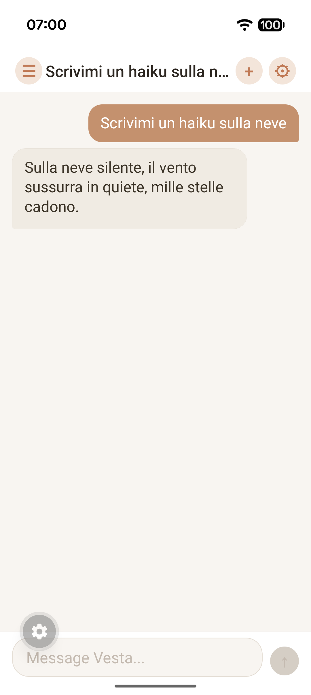
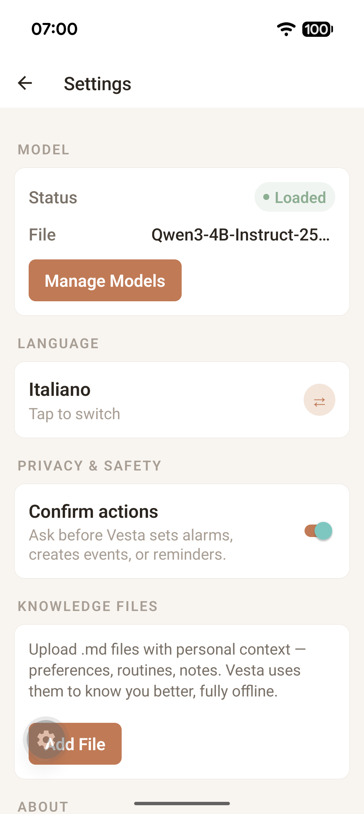
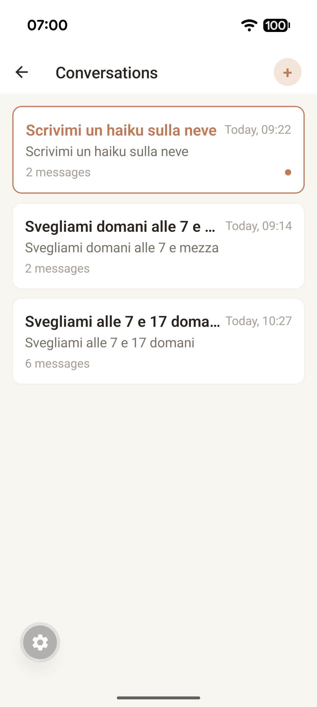

<p align="center">
  
</p>

<h1 align="center">Vesta</h1>

<p align="center">
  <strong>Intelligence that never leaves home.</strong>
</p>

<p align="center">
  An offline-first AI personal assistant that runs entirely on your device.<br />
  Set alarms, create events, manage reminders — no internet required.
</p>

<p align="center">
  <a href="LICENSE"></a>
  <a href="#"></a>
  <a href="#"></a>
  <a href="#"></a>
  <a href="#"></a>
</p>

---

## What is Vesta?

Vesta is an AI assistant that lives on your phone, not in the cloud. It uses [llama.cpp](https://github.com/ggerganov/llama.cpp) to run language models locally and translates natural language into real device actions — setting alarms, creating calendar events, managing reminders — all without sending a single byte to the internet.

Named after the Roman goddess of the hearth, Vesta is the sacred fire that never goes out.

- **Fully offline.** Every feature works without internet. No API keys, no subscriptions, no data leaving your device.
- **Real actions, not just chat.** Vesta doesn't just answer questions — it sets alarms, creates calendar events, and manages reminders through native Android APIs.
- **Privacy by design.** Your conversations, memories, and documents stay on your device. Period.
- **Bilingual from day 1.** English and Italian, with more languages coming.

---

## Features

**On-Device LLM — Bring Your Own Model**
Runs any GGUF model locally via [llama.rn](https://github.com/nickhoo555/llama.rn). Pick the model that fits your device and your language — no cloud, no API calls, no vendor lock-in.

**System Actions**
Natural language maps to real Android intents — `"svegliami alle 7"` actually sets an alarm at 07:00.

**Conversation Memory**
Vesta learns about you across conversations. Personal facts are extracted and stored locally, injected into future prompts for personalized responses.

**Knowledge Files**
Upload `.md` or `.txt` files as portable personal context. Your notes, preferences, and reference docs — always available, always offline.

**Conversation History**
Full conversation persistence with SQLite. Browse, switch, and delete past conversations.

**Home Screen Widget**
2x2 Android widget with quick chat and voice input — one tap to talk to Vesta.

---

## Architecture

```
React Native App (TypeScript)
  └─ Orchestrator
      ├─ Tool Registry (JSON schema)
      ├─ Router (message → LLM → tool_call or text)
      ├─ Memory Manager (extract + inject personal facts)
      └─ Knowledge Manager (portable .md context)
          │
          ▼
Native Bridge (Kotlin)
  ├─ llama.rn — on-device inference
  ├─ SystemActionsModule — Android Intents
  └─ Widget + Voice Activities
          │
          ▼
Local Storage
  ├─ SQLite (messages, conversations, memories, config)
  └─ .gguf model files
```

Full architecture details: [docs/ARCHITECTURE.md](docs/ARCHITECTURE.md)

---

## Quick Start

### Prerequisites

- Node.js 18+
- Android SDK (API 34+)
- Java 17
- A GGUF model file — any model works! We recommend 3B–8B parameter models for phones (e.g., [Qwen3 4B](https://huggingface.co/Qwen/Qwen3-4B-GGUF), [Llama 3.2 3B](https://huggingface.co/bartowski/Llama-3.2-3B-Instruct-GGUF), [Gemma 3 4B](https://huggingface.co/bartowski/gemma-3-4b-it-GGUF))

### Setup

```bash
# Clone
git clone https://github.com/rinaldofesta/vesta.git
cd vesta/apps/mobile

# Install dependencies
npm install --legacy-peer-deps

# Generate native project
npx expo prebuild

# Fix Android SDK path (adjust to your SDK location)
echo "sdk.dir=$HOME/Library/Android/sdk" > android/local.properties

# Set Java (macOS with Homebrew)
export JAVA_HOME=/opt/homebrew/opt/openjdk@17

# Run on connected device or emulator
npx expo run:android
```

### Load a Model

1. Open the app and tap the **Settings** gear icon
2. Tap **Select Model** and pick a `.gguf` file from your device
3. Go back to chat — Vesta is ready

---

<!--
## Screenshots

TODO: Add 3-4 screenshots here. Needed:
- Chat conversation (showing tool call + response)
- Settings screen (model loaded)
- Conversation history
- Home screen widget

Format: PNG, phone frame mockup preferred.
Use a table layout:

| Chat | Settings | History |
|:---:|:---:|:---:|
|  |  |  |
-->

## Benchmark Results

Vesta is model-agnostic — you load whatever GGUF model you prefer. To validate the architecture, we benchmarked several models against 100 function-calling prompts (50 Italian, 50 English) before writing a single line of app code.

| Model | Tool Accuracy | JSON Valid | Latency | Gate |
|-------|:---:|:---:|:---:|:---:|
| Qwen3 4B | **97.8%** | **98.9%** | 18.3s | **PASS** |
| Llama 3.2 3B | ~94% | ~91% | 3.3s | PASS |
| Qwen3 8B | ~90% | ~88% | 25s | BORDERLINE |

These results are specific to our benchmark dataset and system prompt. Your mileage may vary — and that's the point: try different models, find what works best for your device and language. Key finding: system prompt engineering moved accuracy from 42% to 98%. Details in [docs/FASE0-RESULTS.md](docs/FASE0-RESULTS.md).

---

## Roadmap

| Phase | Status | Description |
|-------|:---:|-------------|
| **Fase 0** — Model Validation | Done | Benchmark models, validate architecture, finalize system prompt |
| **Fase 1** — Android MVP | In Progress | Chat UI, 4 tools, orchestrator, conversation history, memory |
| **Fase 2** — Core Polish | Planned | 10 tools, multi-turn context, error recovery |
| **Fase 3** — Document Intelligence | Planned | PDF/DOCX upload, RAG with sqlite-vec, offline search |
| **Fase 4** — Mac Hub | Planned | Optional LAN hub with 70B model via Ollama |
| **Fase 5** — iOS Port | Planned | MLX-Swift for inference, App Intents for actions |
| **Fase 6** — MCP + Advanced | Planned | Expose tools as MCP server, agent swarm, accessibility |

Full roadmap with exit gates: [docs/GAMEPLAN.md](docs/GAMEPLAN.md)

---

## Tech Stack

| Component | Technology | Why |
|-----------|-----------|-----|
| App | React Native + Expo | Cross-platform, TypeScript-native |
| LLM Runtime | llama.cpp via llama.rn | Any GGUF model, GPU acceleration |
| Native Bridge | Kotlin | Android Intents, Foreground Service |
| Orchestrator | TypeScript | Cross-platform logic, strong typing |
| Database | SQLite (expo-sqlite) | Zero config, native performance |
| State | Zustand | Minimal, fast, TypeScript-friendly |
| Models | Any GGUF via llama.cpp | Bring your own — tested with 3B to 8B models |

---

## Project Structure

```
vesta/
├── apps/mobile/               # React Native + Expo app
│   ├── app/                   # Screens (Expo Router)
│   ├── components/            # Chat UI components
│   ├── lib/
│   │   ├── orchestrator/      # Core brain (router, tools, memory)
│   │   ├── llm/               # llama.rn wrapper
│   │   ├── storage/           # SQLite layer
│   │   └── store/             # Zustand state management
│   ├── native/android/        # Kotlin native modules
│   └── plugins/               # Expo config plugins
├── scripts/benchmark/         # Fase 0 model validation
└── docs/                      # Architecture, spec, gameplan
```

---

## Documentation

| Document | Description |
|----------|-------------|
| [Architecture](docs/ARCHITECTURE.md) | System design, principles, data flows |
| [Specification](docs/SPEC.md) | Database schemas, tool schemas, API contracts |
| [Product Requirements](docs/PRD.md) | Vision, user stories, success metrics |
| [Gameplan](docs/GAMEPLAN.md) | Phase-by-phase plan with exit gates |
| [Benchmark Results](docs/FASE0-RESULTS.md) | Model validation data and analysis |

---

## Contributing

Contributions are welcome! Whether it's a bug fix, new tool implementation, or documentation improvement — we'd love your help.

Please read [CONTRIBUTING.md](CONTRIBUTING.md) for development setup and guidelines.

---

## License

MIT License. See [LICENSE](LICENSE) for details.

---

## Acknowledgments

- [llama.cpp](https://github.com/ggerganov/llama.cpp) — The engine that makes on-device LLM possible
- [llama.rn](https://github.com/nickhoo555/llama.rn) — React Native bindings for llama.cpp
- [Expo](https://expo.dev) — Making React Native development sane
- [Qwen](https://huggingface.co/Qwen), [Meta Llama](https://huggingface.co/meta-llama), [Google Gemma](https://huggingface.co/google) — Models we tested against
- [Zustand](https://github.com/pmndrs/zustand) — State management that gets out of the way

---

<p align="center">
  <sub>Named after Vesta, the Roman goddess of the hearth — the sacred fire that never goes out.</sub>
</p>
